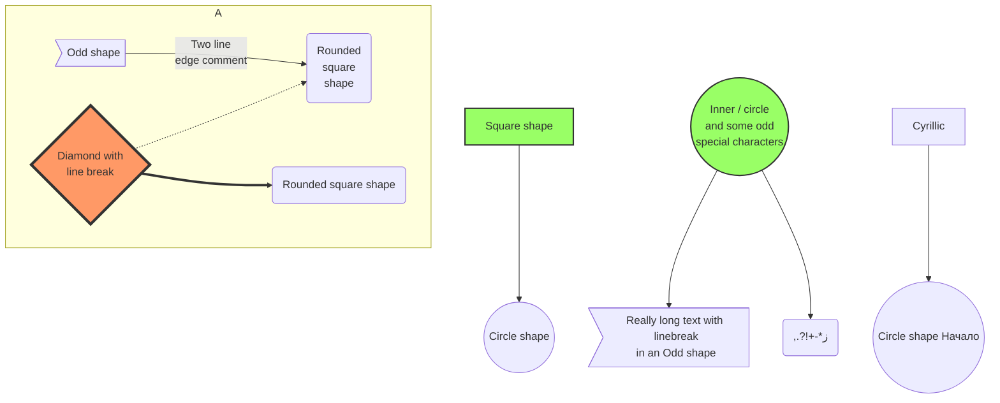

# Anatomy of a CloudFormation Template
  
```yaml
AWSTemplateFormatVersion: 2010-09-09 # The only allowable value is 2010-09-09
Description: # Describes the template
Metadata: # Objects providing additional information about the template
Parameters: # Input parameters to pass to your template at runtime
Rules: # A set of rules to validate the parameters provided during creation or update
Mappings: # Key/value pairs used for lookup at runtime
Conditions: # Conditions that control whether certain resources are created or whether properties are assigned values
Transform: # Customizations for serverless applications
Resources: # Defines resources and their properties, the only required top-level object
Outputs: # Values that are returned whenever you view information about the resources created from this template
```
- [Introduction to CloudFormation](https://jennapederson.com/blog/2021/5/10/introduction-to-aws-cloudformation/)

- [PROVISIONING AN EC2 INSTANCE WITH CLOUDFORMATION](https://jennapederson.com/blog/2021/6/21/provisioning-an-ec2-instance-with-cloudformation-part-1/)

[Include diagrams in your Markdown files with Mermaid](https://github.blog/2022-02-14-include-diagrams-markdown-files-mermaid/)

[About mermaid](http://mermaid-js.github.io/mermaid/#/)

Here is a simple flow chart:



