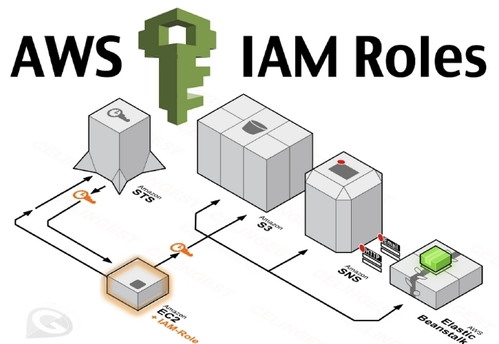

## EC2 Instance Profile and Role

Two parts of IAM 
- Who am I?
- What am I permitted to do?

EC2 instance profile defines “who am I?” Just like an IAM user represents a person, an instance profile represents EC2 instances.
The only permissions an EC2 instance profile has is the power to assume a role.

So the EC2 instance runs under the EC2 instance profile, defining “who” the instance is. It then “assumes” the IAM role, which ultimately gives it any real power.

**When you create an IAM Role for EC2 using the AWS Management Console, it creates both an EC2 instance profile as well as an IAM role.**

However, if you are using the AWS CLI, SDKs, or CloudFormation, you will need to explicitly define both:
- An IAM role with policies and permissions, and
- An EC2 instance profile specifying which roles it can assume

